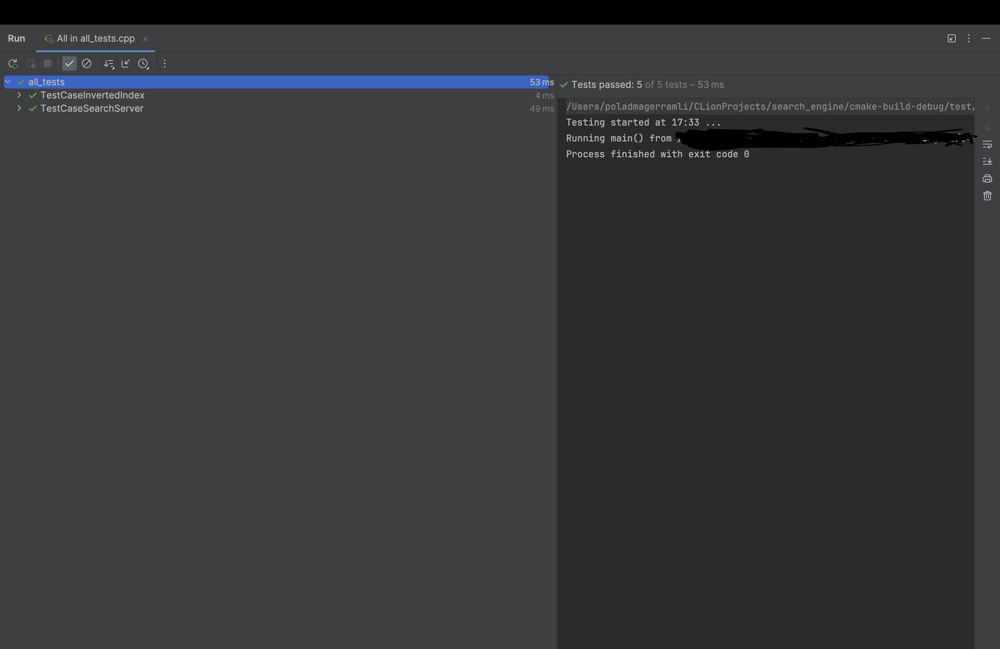

# search_engine

### Здравствуйте! Меня зовут Магеррамли Полад, сегодня предсвляю вам мой поисковой движок по файлам. Без лишних слов, начнем.
---

И так, как я уже сказал, это поисковой движок. Давайте сначала разберем файлы, из которых он состоит.

Начнем с самого начала. У нас есть 3 файла, в которые и с которых будут братся файлы для поиска, запросы и ответы. Все они в формате JSON.
---
#### Файл Config.json
```json
{
  "config": {
  
    "name": "SkillboxSearchEngine",
    "version": "0.1",
    "max_responses": 5
  
  }, "files": [
    "../resources/file001.txt",
    "../resources/file002.txt",
    "../resources/file003.txt",
    "../resources/file004.txt",
  ]
}
```

Давайте разберем этот файл. Внутри поля **"config"** у нас есть 3 параметра:
1. name : Нужен для задания названия движка.
2. version : Нужен для задания версии движка.
3. max_responses : Нужен для задания максимального количества ответов(по дефолту: 5).


В поле **"files"** у нас хранятся пути ко всем файлам, по которым нужно осуществлять поиск.

Перейдем к файлу для **запросов**.
---
#### Файл Requests.json

```json 
{
  "requests": [
    "some words..",
    "some words..",
    "some words..",
    "some words..",
  ]
}
```

Что же у нас в этом файле? Ну тут разбирать особо нечего, в поле **"requests"** хранятся все ваши запросы.


Без лишних слов перейдем к последнему JSON файлу - **answers.json**
---
#### Файл Answers.json

```json

{
  "answers": {
  
    "request001": {

      "result": "true",
      "relevance": {
        "docid": 0, "rank" : 0.989,
        "docid": 1, "rank" : 0.897,
        "docid": 2, "rank" : 0.750,
        "docid": 3, "rank" : 0.670,
        "docid": 4, "rank" : 0.561
      }
    
    }, "request002": {
    
      "result": "true",
      "docid": 0, "rank" : 0.769

    }, "request003": {
    
      "result": "false"

    }

  }

}
```
Тут уже полей побольше. Давайте разберем.

Все начинается с поля **"answers"**, который хранит все результаты поиска. Разберем параметры этого поля

**"request000"** хранит в себе номер запроса из файла **Requests.json**, и ответы на него в ответе есть 2 параметра:
1. **result** : Хранит в себе результат поиска: True если есть файл или файлы, в которых мы нашли запросы, которые были прописаны в файле.
2. **relevance** : Хранит отсортированные по рейтингу ответы из 2 параметров :
   1. docid : индекс документа из файла **Config.json**
   2. rank : относительный рейтинг(О котором будет сказано ниже)
  
На этом мы зкончили изучение JSON файлов. Перейдем к файлам и директориям с исходными файлами.
---

У нас есть директория **nlohmann_json** которая хранит в себе набор функций для работы с JSON файлами в коде. Есть директория **Cmake-build-debug** которая отвечает за сборку. Давайте перейдем к более интересным файлам и директориям: В которых и хранится код нашего движка.

С директориями мы тоже закончили. Теперь начнем изучение Исходных файлов.
---

У нас есть 2 файла и 1 директория, в которых содержатся наши исходные файлы. 
1. Файл search_engine.h - это загаловочный файл, в котором содержатся все функции классы, структуры и т.д.
2. Файл test.cpp в директории test - это файл с тестами, для проверки работаспособности проекта.
3. Основной файл main.cpp - файл, в котором и запускается наш движок: проверяются необхожимые зависимости и т.д.

Также у нас есть 2 Cmakelists.txt для сборки проекта и тестового проекта. 

Запуск
---
При запуске проекта у вас должно появится сообщение:
`Welcome to "SkillboxSearchEngine" !`

Но у вас также может появится сообщение `config file is empty!`: Это означает отсудствие файла config.json. Для исправления можете заново установить репозиторий,

Если у вас появилось сообщение `in config file empty config!`, это значит что в том же config.json отсутствует поле config со всей информацией(которую мы рассмотрели выше),

И последнее, что у вас может появится, это `file path is incorrect!` это означает, что вы указали неверные пути к файлам в файле `config.json`. 

Вот что вы должны получить, если запустите тестовый проект




**На этом все! Желаю удачи в использовании!**

## License
This project is licensed under the MIT License - see the [LICENSE](LICENSE) file for details.

